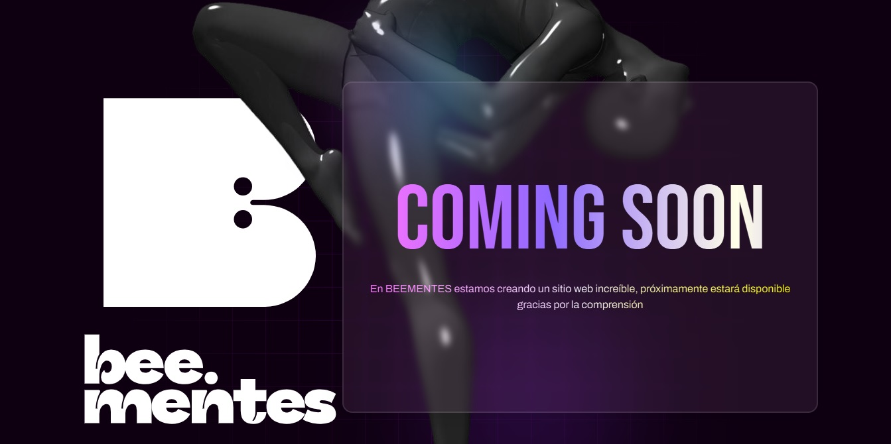

<!-- PROJECT LOGO -->

  

  <h3 align="center">Beementes | Agencia de Diseño y Producción Audiovisual</h3>

  

Este repositorio contiene el código fuente de la página web oficial de Beementes, una agencia especializada en diseño y producción audiovisual. La web ha sido desarrollada utilizando React para la estructura y componentes, junto con CSS Vanilla para un estilo personalizado y ligero.
     
    <a align="center" href="https://beementes.com/"><strong> Website »</strong></a>
     
  

  

